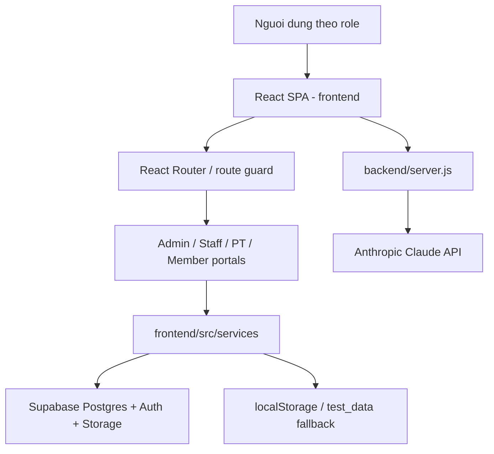
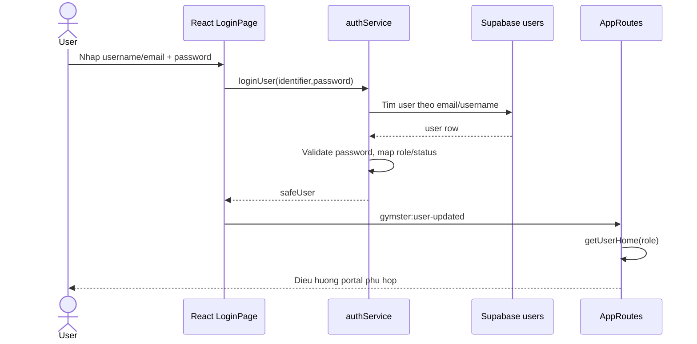
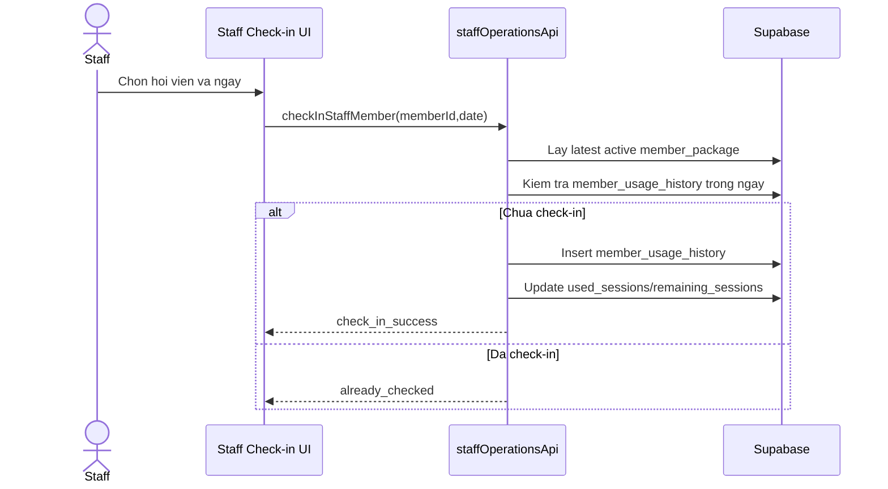
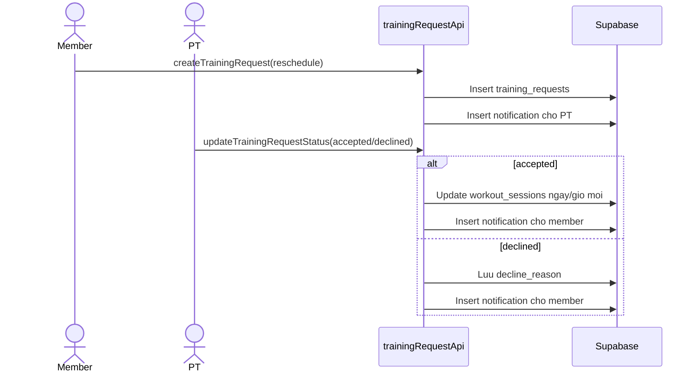

# 02 - Architectural Design Context

## Kien truc tong the

Gymster hien tai la ung dung web single-page application voi frontend React/Vite la trung tam. Data duoc lay tu Supabase thong qua service layer trong frontend. Backend Node.js hien tai dong vai tro API phu tro cho AI chat/Claude, chua phai backend nghiep vu day du.

## Technology stack

| Lop | Cong nghe |
| --- | --- |
| Frontend | React 19, Vite 8, React Router 7 |
| Styling/UI | Tailwind CSS 4, CSS variables, lucide-react, recharts, motion |
| Data | Supabase JS, PostgreSQL-compatible schema |
| Backend AI | Node.js HTTP server, Anthropic SDK |
| Testing | `node:test`, `node:assert/strict` |
| Design source | Figma-exported React/Tailwind code trong `source_figma/` |

## Module chinh

### Frontend shell

- `frontend/src/main.jsx`: mount React app, wrap BrowserRouter, LanguageProvider, AppearanceProvider.
- `frontend/src/App.jsx`: render `AppRoutes`.
- `frontend/src/routes/AppRoutes.jsx`: public routes, role routes, onboarding routes, route guard.
- `frontend/src/roles/shared`: RoleShell, notifications, account/profile/settings shared, language/theme context.

### Portal modules

| Portal | Entry | Chuc nang |
| --- | --- | --- |
| Admin | `frontend/src/roles/admin/App.tsx` | Executive dashboard, revenue, membership, staff, scheduling, performance, payroll, equipment, maintenance, feedback, packages |
| Staff | `frontend/src/roles/staff/App.tsx` | Dashboard, add member, members, check-in, renew package, receipts, history, feedback, equipment, notifications, settings/profile |
| PT | `frontend/src/roles/pt/App.tsx` | Dashboard, trainees, member detail, schedule, workout, equipment report, evaluation, meal plan, notifications, profile/settings |
| Member | `frontend/src/roles/member/routes.tsx` | Dashboard, my package, my schedule, trainers, rate service, profile/settings, select package onboarding |

### Service layer

Service layer gom logic mapping Supabase rows -> UI model, fallback local, validation va cac workflow nghiep vu. Cac file quan trong:

- `authService.js`: login, OAuth, current session, role home, user mapping.
- `memberPackageApi.js`: member package, package change request, renewal.
- `trainingRequestApi.js`: training request assignment/reschedule/makeup, status update, notifications.
- `workoutSessionApi.js`: workout session, cancel, reschedule, PT content, makeup session summary.
- `workoutPlanApi.js` + `workoutPlanModel.js`: CRUD workout plan va normalize exercises.
- `staffOperationsApi.js`: staff member management, check-in, feedback, equipment, maintenance report.
- `adminDataApi.js`: admin dashboard/analytics/payroll/equipment/feedback data.
- `ptDataApi.js`: gom data cho PT portal.
- `notificationApi.js`: local/Supabase notifications.
- `userProfileApi.js`: profile, avatar, settings, password/contact.
- `packageApi.js`, `paymentApi.js`, `invoiceApi.js`, `trainerApi.js`: domain API phu tro.

## Database architecture

Database nam trong Supabase/Postgres. Cac table chinh:

- Identity/account: `users`, `user_settings`.
- Membership: `members`, `packages`, `package_features`, `member_packages`, `package_change_requests`, `member_usage_history`.
- Training/PT: `trainers`, `trainer_weekly_availability`, `trainer_assignments`, `training_requests`, `workout_sessions`, `workout_plans`, `workout_plan_exercises`, `training_goals`, `progress_records`, `body_metrics`, `medical_records`, `medical_history_requests`, `meal_plans`, `meal_plan_assignments`, `makeup_sessions`.
- Payment: `payments`, `invoices`.
- Operations: `employees`, `employee_schedules`, `payroll_periods`, `payslips`, `performance_reviews`.
- Facility: `rooms`, `equipment`, `maintenance_reports`, `maintenance_records`.
- Engagement: `service_feedback`, `complaints`, `notifications`.

## High-level data flow

### Login va role routing

### Check-in hoi vien

### PT xu ly request doi lich

## Deployment context

- Root `package.json` delegate script vao frontend:
  - `npm run dev` -> `npm --prefix frontend run dev`
  - `npm run build` -> `npm --prefix frontend run build`
  - `npm run preview` -> `npm --prefix frontend run preview`
  - `npm run lint` -> `npm --prefix frontend run lint`
- Backend chay rieng: `npm run dev:backend` -> `node backend/server.js`.
- Frontend can env:
  - `VITE_SUPABASE_URL`
  - `VITE_SUPABASE_PUBLISHABLE_KEY`
- Backend AI can env:
  - `ANTHROPIC_API_KEY`

## Kien truc hien tai va huong mo rong

- Hien tai frontend goi Supabase truc tiep qua service layer, phu hop MVP/demo.
- Neu production, nen bo sung backend nghiep vu rieng de bao ve business rules, secret, audit log va authorization role-aware.
- RLS hien tai la demo policy; can thay bang policy theo authenticated user/role.
- AI endpoint da tach ra backend, tranh expose Anthropic API key ra frontend.
