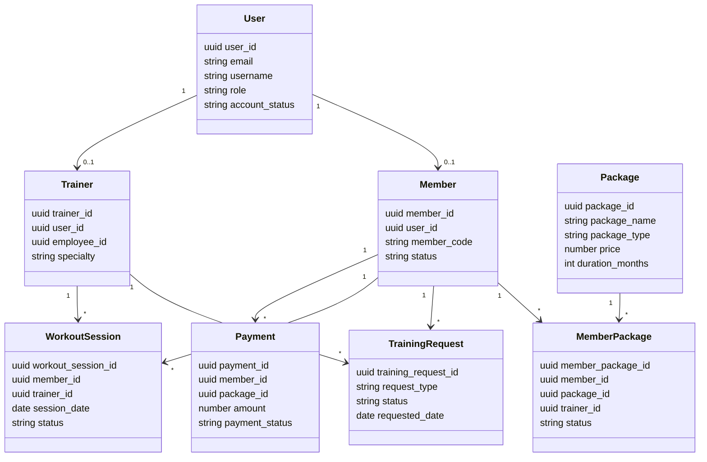

# 03 - Detailed Design Context

## Domain model tong quat

## Bang du lieu chinh va vai tro

| Bang | Vai tro |
| --- | --- |
| `users` | Tai khoan app, role, auth metadata, profile co ban |
| `user_settings` | Cai dat ngon ngu, theme, notification |
| `members` | Ho so hoi vien gan voi user |
| `employees` | Ho so nhan su/staff/admin |
| `trainers` | Ho so PT, co the gan user/employee |
| `trainer_weekly_availability` | Lich ranh dinh ky cua PT |
| `packages` | Goi tap, gia, thoi han, session limit |
| `package_features` | Feature cua tung goi |
| `member_packages` | Goi ma hoi vien da mua/dang dung |
| `package_change_requests` | Yeu cau mua/gia han/doi goi |
| `payments` | Giao dich thanh toan |
| `invoices` | Hoa don |
| `training_requests` | Yeu cau gan PT, doi lich, makeup session |
| `workout_sessions` | Buoi tap / buoi PT |
| `workout_plans` | Ke hoach tap |
| `workout_plan_exercises` | Bai tap trong workout plan |
| `trainer_assignments` | Gan PT cho hoi vien |
| `training_goals` | Muc tieu tap luyen |
| `progress_records` | Ghi nhan tien do |
| `body_metrics` | Chi so co the |
| `medical_records` | Thong tin y te |
| `medical_history_requests` | Yeu cau xem/cap nhat medical history |
| `meal_plans` | Ke hoach dinh duong |
| `meal_plan_assignments` | Gan meal plan cho hoi vien |
| `rooms` | Phong/khu vuc |
| `equipment` | Thiet bi |
| `maintenance_reports` | Bao cao su co thiet bi |
| `maintenance_records` | Lich su bao tri |
| `service_feedback` | Danh gia dich vu |
| `complaints` | Khieu nai |
| `member_usage_history` | Lich su check-in/su dung dich vu |
| `notifications` | Thong bao |
| `employee_schedules` | Lich lam viec nhan vien |
| `payroll_periods`, `payslips` | Ky luong va phieu luong |
| `performance_reviews` | Danh gia hieu suat |
| `makeup_sessions` | Tong hop su dung buoi tap bu |

## Component/module design

### Route design

- `AppRoutes.jsx` la entry routing toan app.
- `RoleRoute` chan user khong dung role.
- `PublicRoute` redirect user da dang nhap ve home.
- `FallbackRoute` dua ve `/` hoac home theo role.
- Member route co them membership lock neu active member het/khong co goi kha dung.

### Shared layout design

- `RoleShell`: layout chung cho portal co sidebar/menu/search/avatar.
- `AppearanceContext`: quan ly dark mode.
- `LanguageContext`: quan ly ngon ngu.
- `RoleNotificationsPage`: trang thong bao dung chung.
- `AccountProfile`, `AccountSettings`: ho so/cai dat dung chung.

### Service design patterns

- Service function thuong tra ve `{ data, error }` hoac `{ ok, message }`.
- Mapper tach UI model khoi DB schema, vi du:
  - `mapMemberPackageRow`
  - `mapTrainingRequestRow`
  - `mapPaymentRow`
  - `mapInvoiceRow`
  - `mapNotificationRow`
- Co helper resolve id tu current user/email/username de tranh UI phai biet chi tiet schema.
- Co fallback localStorage khi Supabase chua cau hinh hoac id local khong phai UUID.

## Flow chi tiet theo nghiep vu

### Tao hoi vien boi staff

1. Staff nhap form hoi vien.
2. `createStaffMember(form)` validate username.
3. Insert `users` voi role `member`, account_status `pending_payment`.
4. Insert `members`.
5. Neu co `trainerId` hop le, insert `trainer_assignments`.
6. Tra ve `memberId` va message.

### Check-in hoi vien

1. `checkInStaffMember(memberId,date)`.
2. Lay latest active package tu `member_packages`.
3. Kiem tra goi active, chua het han.
4. Kiem tra `member_usage_history` trong ngay.
5. Insert usage type `check_in`.
6. Update `used_sessions`, `sessions_used`, `remaining_sessions`.

### Tao package change request

1. Member/staff gui request package.
2. `createPackageChangeRequest(request)` resolve member id.
3. Insert `package_change_requests` voi status `pending`.
4. Staff/admin xem danh sach qua `getPackageChangeRequests()`.
5. Staff/admin update status bang `updatePackageChangeRequestStatus()`.

### Tao training request

1. Member chon request type: assignment, reschedule, makeup PT session, cancel.
2. `createTrainingRequest(request)` quyet dinh Supabase hay local fallback.
3. Insert `training_requests`.
4. Tao notification cho trainer neu request can PT xu ly.
5. PT update status qua `updateTrainingRequestStatus`.
6. Neu accept:
   - assignment: tao notification thong tin PT.
   - reschedule: update `workout_sessions`.
   - makeup: tao workout session moi va update makeup usage.

### Workout plan

1. PT nhap draft plan va exercises.
2. `normalizeWorkoutPlanDraft(draft)` chuan hoa thanh payload DB.
3. `createWorkoutPlan`, `updateWorkoutPlan`, `deleteWorkoutPlan` thao tac `workout_plans` va `workout_plan_exercises`.
4. `validateWorkoutPlanDraft` dam bao co ten plan va exercise hop le.

## API/service map theo portal

| Portal | Service chinh |
| --- | --- |
| Landing/Auth | `landingApi`, `authService`, `userApi` |
| Member package | `memberPackageApi`, `packageApi`, `paymentApi`, `invoiceApi` |
| Member schedule | `workoutSessionApi`, `trainingRequestApi`, `trainerAvailabilityApi`, `workoutSessionConflict` |
| Member feedback | `memberEngagementApi` |
| Staff operations | `staffDashboardApi`, `staffOperationsApi`, `memberPackageApi`, `paymentApi`, `invoiceApi` |
| PT portal | `ptDataApi`, `trainingRequestApi`, `workoutSessionApi`, `workoutPlanApi`, `medicalHistoryApi`, `memberCareApi` |
| Admin portal | `adminDataApi`, `maintenanceService`, `packageApi` |
| Shared profile/notification | `userProfileApi`, `notificationApi` |
| AI | `aiChatApi`, `staffAiChatApi`, backend `aiChatService`, `staffAiChatService`, `claudeService` |

## Validation/context can dua vao detailed design

- Username: 6-30 ky tu, bat dau/ket thuc bang chu/so, cho phep `_`, `.`, `-`.
- Phone: 10-11 chu so.
- Birth date: phai sau 1900 va truoc ngay hien tai.
- UUID pattern duoc dung de phan biet id local/demo va id Supabase.
- Status duoc normalize giua UI va DB:
  - Account: `pending_onboarding`, `pending_pt_approval`, `pending_payment`, `active`, `cancelled`, `inactive`, `suspended`.
  - Training request: `pending_pt_approval`, `accepted/approved`, `declined`, `expired`, `cancelled`, `completed`.
  - Workout session: scheduled/completed/incomplete/cancelled va label hien thi.

## Doi tuong UI quan trong

- Member: Dashboard, MyPackage, MySchedule, Trainers, RateService, Profile, Settings.
- Staff: Dashboard, AddMember, MemberList, MemberDetail, DailyCheckIn, RenewPackage, ReceiptDetail, ViewHistory, FeedbackManagement, EquipmentStatus.
- PT: DashboardScreen, ManageTraineesScreen, MemberDetailScreen, ScheduleProgressScreen, WorkoutGuidanceScreen, EquipmentReportScreen, ProgressEvaluationScreen, MealPlanScreen.
- Admin: ExecutiveDashboard, RevenueAnalytics, MembershipAnalytics, StaffManagement, Scheduling, PerformanceEvaluation, Payroll, EquipmentManagement, MaintenanceTracking, FeedbackSatisfaction, PackagesPayments.

## Diagram context goi y

- ERD nen bat dau tu `users`, `members`, `trainers`, `packages`, `member_packages`, `training_requests`, `workout_sessions`, `payments`, `equipment`, `maintenance_reports`.
- Sequence diagram nen ve cac flow: login, onboarding, check-in, reschedule request, maintenance report.
- Class diagram nen tap trung domain class, khong can ve toan bo React component.
