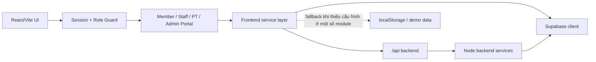
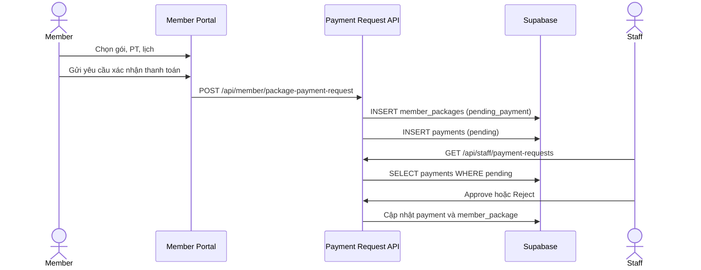
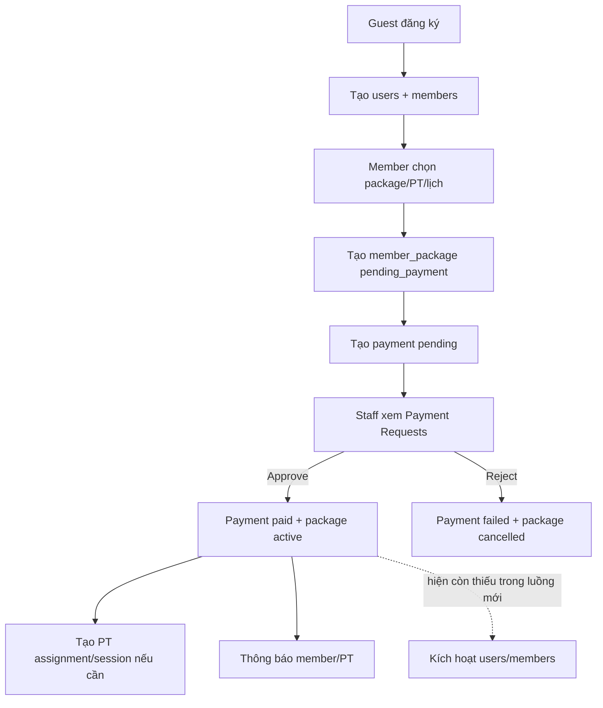
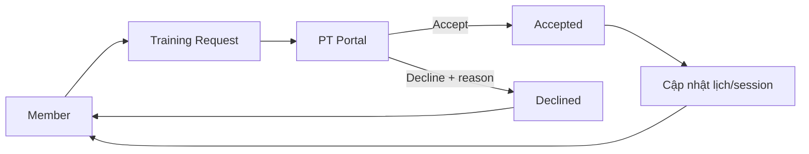
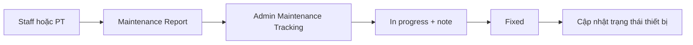
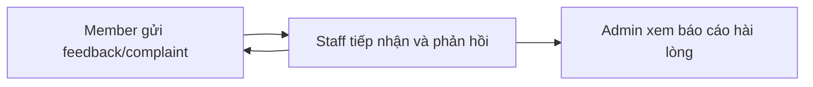

# 09 - Luồng hoạt động logic của người dùng trong Gymster

## 1. Mục đích tài liệu

Tài liệu này mô tả các luồng nghiệp vụ đang tồn tại trong codebase Gymster tại thời điểm rà soát ngày 18/06/2026.

Nội dung được tổng hợp từ:

- Đề bài **Chủ đề 02 - Hệ thống quản lý phòng tập Gym**, trang 4-5 của file `Topics-Phat trien phan mem ITSS-20252.pdf`.
- Route và role guard trong `frontend/src/routes/AppRoutes.jsx`.
- Các portal trong `frontend/src/roles/`.
- Service layer trong `frontend/src/services/`.
- Backend nghiệp vụ trong `backend/server.js` và `backend/services/`.
- Serverless handlers dùng khi deploy Vercel trong `api/`.
- Cấu trúc dữ liệu trong `database/schema.sql` và các migration bổ sung.

Tài liệu phân biệt ba mức:

- **Đã kết nối dữ liệu**: UI đang đọc/ghi Supabase hoặc backend API.
- **Có fallback/demo**: khi API hoặc cấu hình thiếu, hệ thống có thể dùng localStorage hoặc dữ liệu mẫu.
- **Chưa khép kín**: có UI hoặc một phần service nhưng chuỗi nghiệp vụ liên vai trò chưa hoàn tất.

---

## 2. Yêu cầu gốc từ đề bài

### 2.1 Các vai trò được yêu cầu

| Vai trò trong đề bài | Vai trò trong Gymster | Trách nhiệm chính |
| --- | --- | --- |
| Chủ phòng tập | `admin`, `owner` | Quản lý tổng thể, doanh thu, nhân sự, hội viên, thiết bị, phản hồi |
| Nhân viên quản lý | `staff` | Vận hành hằng ngày, đăng ký/gia hạn, check-in, phản hồi, thiết bị |
| Huấn luyện viên cá nhân | `trainer`, ánh xạ frontend thành `pt` | Quản lý học viên, lịch tập, hướng dẫn và đánh giá tiến độ |
| Hội viên | `member` | Đăng ký, chọn gói, theo dõi gói/lịch tập và đánh giá dịch vụ |

Gymster bổ sung thêm:

- **Guest/Visitor**: truy cập landing page, đăng ký, đăng nhập.
- **System/AI**: trợ lý AI, thông báo, speech-to-text và các tác vụ nền.

### 2.2 Các nhóm chức năng đề bài yêu cầu

1. Quản lý phòng tập, thiết bị, nhân sự và phản hồi.
2. Quản lý thông tin, đăng ký, gia hạn và lịch sử sử dụng của hội viên.
3. Quản lý gói tập, thanh toán và biên lai.
4. Báo cáo doanh thu, hội viên và hiệu suất nhân sự.

### 2.3 Các quy trình nghiệp vụ đề bài yêu cầu

1. Đăng ký hội viên mới.
2. Ghi nhận lịch sử tập luyện và theo dõi gói tập.
3. Báo cáo và xử lý bảo trì thiết bị.

---

## 3. Kiến trúc luồng tổng quát

### 3.1 Xác thực và phiên đăng nhập

- Người dùng đăng nhập bằng username/email và mật khẩu.
- Frontend ưu tiên gọi `POST /api/auth/login`.
- Khi backend login không khả dụng trong một số tình huống, code còn có nhánh đăng nhập trực tiếp/fallback.
- Thông tin người dùng hiện tại được lưu trong localStorage:
  - `gymster_current_user`
  - `gymster_current_session`
- Phiên mặc định kéo dài một ngày; tùy chọn ghi nhớ đăng nhập kéo dài hai tuần.
- `AppRoutes` kiểm tra vai trò trước khi cho phép vào portal.

### 3.2 Ánh xạ vai trò và trang chủ

| Role dữ liệu | Role route | Trang chính |
| --- | --- | --- |
| `owner` | `admin` | `/admin` |
| `admin` | `admin` | `/admin` |
| `staff` | `staff` | `/staff` |
| `trainer` | `pt` | `/pt` |
| `pt` | `pt` | `/pt` |
| `member` | `member` | `/member` |

Người chưa đăng nhập truy cập portal sẽ bị chuyển về `/login`. Người đăng nhập sai vai trò sẽ bị chuyển về trang chủ đúng vai trò.

---

## 4. Luồng Guest/Visitor

### 4.1 Xem landing page

1. Guest truy cập `/`.
2. Landing page tải các số liệu/khối giới thiệu của Gymster.
3. Guest có thể chuyển đến `/login` hoặc `/register`.
4. Nếu đã có phiên đăng nhập, `PublicRoute` chuyển thẳng đến portal tương ứng.

### 4.2 Đăng ký tài khoản member bằng email và mật khẩu

Luồng hiện tại:

1. Guest nhập họ tên, username, email, mật khẩu, số điện thoại, ngày sinh và giới tính tại `/register`.
2. Frontend kiểm tra:
   - Đủ trường bắt buộc.
   - Email đúng định dạng.
   - Username dài 6-30 ký tự và đúng tập ký tự.
   - Mật khẩu có tối thiểu 8 ký tự, chữ hoa, số và ký tự đặc biệt.
   - Số điện thoại gồm 10-11 chữ số.
   - Ngày sinh hợp lệ.
   - Đã đồng ý điều khoản.
3. Frontend gọi `POST /api/auth/register`.
4. Backend:
   - Kiểm tra lại dữ liệu.
   - Kiểm tra trùng email và username.
   - Hash mật khẩu bằng bcrypt.
   - Tạo hàng trong `users` với:
     - `role = member`
     - `account_status = pending_onboarding`
   - Tạo hàng tương ứng trong `members` với trạng thái pending.
5. Frontend lưu user vào session localStorage.
6. Người dùng được chuyển vào `/member`.
7. Vì chưa active, Member Portal chuyển tiếp đến `/member/select-package`.

Luồng này hiện **không yêu cầu mã xác minh email**.

### 4.3 Đăng ký/đăng nhập bằng Google hoặc Facebook

1. Guest chọn Google hoặc Facebook.
2. Supabase Auth thực hiện OAuth và quay lại `/auth/callback`.
3. Hệ thống tìm user Gymster đã liên kết bằng `auth_user_id` hoặc email.
4. Nếu chưa đủ hồ sơ, người dùng được chuyển đến `/auth/complete-profile`.
5. Hệ thống tạo `users` và `members` với trạng thái onboarding.
6. Member được chuyển đến `/member`.

### 4.4 Quên mật khẩu

1. Guest truy cập `/forgot-password`.
2. Nhập email và yêu cầu mã.
3. Backend tạo mã trong `password_reset_verifications`.
4. Nếu SMTP được cấu hình, mã được gửi qua email.
5. Người dùng xác minh mã và đặt mật khẩu mới.

Đây là luồng email-code còn lại trong hệ thống.

---

## 5. Luồng hội viên - Member

## 5.1 Trạng thái logic của tài khoản member

| Trạng thái | Ý nghĩa dự kiến |
| --- | --- |
| `pending_onboarding` | Đã tạo tài khoản nhưng chưa hoàn tất đăng ký gói |
| `pending_pt_approval` | Đang chờ PT duyệt yêu cầu |
| `pending_payment` | Đã chọn gói/huấn luyện viên và chờ thanh toán |
| `active` | Hội viên đã được kích hoạt |
| `cancelled` / `inactive` / `suspended` | Yêu cầu hoặc tài khoản không còn hoạt động |

Frontend đồng thời dùng hai kiểu tên:

- Database: `pending_onboarding`, `active`, ...
- UI: `PendingOnboarding`, `Active`, ...

### 5.2 Luồng onboarding hiện đang được dùng tại Member Portal

Route chính: `/member/select-package`.

1. Member mới đăng nhập.
2. Member Portal kiểm tra `accountStatus/account_status`.
3. Nếu chưa active, menu chỉ hiển thị:
   - Select Package.
   - Settings.
4. Hệ thống tải danh sách gói từ `packages`.
5. Member chọn gói.
6. Nếu gói có PT:
   - Tải danh sách trainer.
   - Tải lịch rảnh hằng tuần.
   - Member chọn PT và một hoặc nhiều khung giờ theo rule của gói.
7. Member chọn phương thức thanh toán mô phỏng.
8. Member bấm **Gửi yêu cầu xác nhận thanh toán**.
9. Frontend gọi `POST /api/member/package-payment-request`.
10. Backend dự kiến:
    - Tìm hồ sơ member.
    - Tạo `member_packages` với `status = pending_payment`.
    - Tạo `payments` với `payment_status = pending`.
    - Tạo thông báo cho các staff active.
11. Staff xem yêu cầu tại `/staff/payment-requests`.
12. Staff approve hoặc reject.

### 5.3 Điểm chưa khép kín trong onboarding mới

Luồng approve trong `paymentRequestService` hiện:

- Đổi `member_packages.status` thành `active`.
- Ghi `start_date`, `end_date`, `activated_at`.
- Đổi `payments.payment_status` thành `paid`.
- Tạo assignment/session nếu gói có PT.
- Gửi notification cho member và PT.

Nhưng luồng này **chưa cập nhật**:

- `users.account_status` thành `active`.
- `members.status` thành `active`.

Vì Member Portal quyết định active/inactive dựa trên current user, member mới có thể vẫn bị giữ ở màn hình onboarding sau khi staff duyệt. Đây là một chuỗi nghiệp vụ chưa hoàn tất.

### 5.4 Luồng onboarding cũ còn tồn tại

Các route cũ vẫn được khai báo:

- `/onboarding/status`
- `/onboarding/packages`
- `/onboarding/trainers`
- `/onboarding/payment`
- `/onboarding/success`

Luồng cũ:

1. Chọn package.
2. Nếu có PT, tạo training request và chờ PT.
3. Thực hiện payment trực tiếp với trạng thái paid.
4. Kích hoạt member package.
5. Gọi `activateMemberAccount` để cập nhật `users` và `members` thành active.
6. Tạo assignment và workout session.
7. Chuyển đến trang success.

Luồng cũ có các nút **Simulate Trainer Accept/Decline**, cho thấy một phần được thiết kế để demo. Hiện codebase có cả luồng cũ và luồng mới, nhưng đường redirect chính của member mới đang đi qua `/member/select-package`.

### 5.5 Member Portal khi đã active

Các màn hình:

| Route | Chức năng |
| --- | --- |
| `/member` | Dashboard gói tập, lịch tập và trạng thái gần nhất |
| `/member/my-package` | Gói hiện tại, giao dịch, biên lai, yêu cầu đổi/gia hạn |
| `/member/my-schedule` | Lịch tập, buổi tập, hủy/đổi lịch, buổi bù, buổi tự tập |
| `/member/trainers` | Danh sách PT và yêu cầu PT |
| `/member/rate-service` | Gửi feedback hoặc complaint và xem phản hồi |
| `/member/notifications` | Thông báo |
| `/member/profile` | Hồ sơ cá nhân |
| `/member/settings` | Ngôn ngữ, giao diện, mật khẩu và thiết lập tài khoản |

### 5.6 Theo dõi gói tập

1. Member Portal truy vấn member package hiện tại.
2. Hệ thống xác định:
   - Gói có active không.
   - Ngày bắt đầu/kết thúc.
   - Số ngày còn lại.
   - Số buổi đã dùng/còn lại.
3. Nếu gói sắp hết hạn, UI hiển thị cảnh báo.
4. Nếu tài khoản active nhưng không có gói sử dụng được:
   - Nội dung portal bị khóa.
   - Member được yêu cầu gia hạn hoặc đăng ký gói mới.
5. Member có thể xem chi tiết receipt và tải PDF nếu API tương ứng hoạt động.

### 5.7 Lịch tập, hủy lịch và đổi lịch

1. Member tải workout sessions theo member hiện tại.
2. Member xem trạng thái scheduled/completed/cancelled.
3. Khi hủy:
   - Hệ thống kiểm tra rule thời gian.
   - Ghi nhận quyền buổi bù theo loại gói.
   - Có thể tạo training request để PT xử lý.
4. Khi đổi lịch:
   - Member chọn slot PT còn trống.
   - Tạo request reschedule.
   - PT nhận request và accept/decline.
5. Member có thể tạo buổi tập thủ công cho hoạt động tự tập.

### 5.8 Đánh giá dịch vụ và khiếu nại

1. Member chọn đối tượng đánh giá: dịch vụ, PT, nhân viên hoặc cơ sở vật chất.
2. Gửi rating và nội dung vào `service_feedback`.
3. Hoặc gửi complaint vào `complaints`.
4. Staff tiếp nhận và cập nhật phản hồi/trạng thái.
5. Admin xem báo cáo tổng hợp mức độ hài lòng.

### 5.9 Hồ sơ y tế

1. Member mở Medical History modal.
2. Member nhập bệnh nền, chấn thương, dị ứng, thuốc, giới hạn tập và liên hệ khẩn cấp.
3. Dữ liệu được lưu để PT xem khi hướng dẫn tập.
4. PT cũng có thể gửi yêu cầu member hoàn thiện lịch sử y tế.

---

## 6. Luồng nhân viên quản lý - Staff

### 6.1 Các route staff

| Route | Chức năng |
| --- | --- |
| `/staff/dashboard` | Dashboard vận hành |
| `/staff/add-member` | Tạo hội viên tại quầy |
| `/staff/members` | Danh sách hội viên |
| `/staff/members/:id` | Chi tiết hội viên |
| `/staff/check-in` | Check-in hằng ngày |
| `/staff/renew-package` | Gia hạn/đổi gói |
| `/staff/payment-requests` | Duyệt yêu cầu xác nhận thanh toán |
| `/staff/receipt/:id` | Chi tiết biên lai |
| `/staff/history` | Lịch sử sử dụng |
| `/staff/feedback` | Xử lý feedback/complaint |
| `/staff/equipment` | Theo dõi thiết bị và bảo trì |
| `/staff/notifications` | Thông báo |
| `/staff/profile`, `/staff/settings` | Hồ sơ và thiết lập |

### 6.2 Tạo hội viên tại quầy

1. Staff nhập thông tin cá nhân.
2. Chọn gói và PT nếu cần.
3. Service tạo:
   - `users`
   - `members`
   - `member_packages`
   - payment ban đầu tùy dữ liệu form
4. Hội viên xuất hiện trong danh sách staff.

Luồng này gần với quy trình đề bài “nhân viên tiếp nhận và tạo hồ sơ”.

### 6.3 Danh sách và cập nhật hội viên

1. Staff tải toàn bộ `members`.
2. Service tải thêm:
   - User tương ứng.
   - Member package mới nhất/đang active.
   - Package tương ứng.
3. UI ghép dữ liệu thành hồ sơ hiển thị.
4. Staff có thể:
   - Xem chi tiết.
   - Sửa thông tin.
   - Vô hiệu hóa tài khoản.
   - Gia hạn gói.

Lưu ý: hàm hiển thị trạng thái hiện quy mọi trạng thái không thuộc nhóm inactive/expired về `Active`, nên member `pending` có thể được trình bày như active trong Member List.

### 6.4 Check-in

1. Staff chọn ngày.
2. Hệ thống tải danh sách member và check-in của ngày.
3. Staff chọn hội viên.
4. Hệ thống kiểm tra gói có hiệu lực.
5. Nếu hợp lệ, hệ thống ghi `member_usage_history`.
6. Dashboard và lịch sử sử dụng có thể đọc lại dữ liệu này.

### 6.5 Gia hạn gói

1. Staff chọn member.
2. Chọn gói/thời hạn và thông tin thanh toán.
3. Service cập nhật hoặc tạo member package.
4. Ghi payment.
5. Có thể tạo invoice/receipt.
6. Member xem lại gói và biên lai trong portal.

### 6.6 Duyệt yêu cầu thanh toán

1. Staff mở `/staff/payment-requests`.
2. UI gọi `GET /api/staff/payment-requests`.
3. Backend chỉ trả các `payments` có `payment_status = pending`.
4. Staff chọn:
   - **Approve**:
     - payment thành `paid`.
     - member package thành `active`.
     - tạo assignment/session nếu có PT.
     - gửi notification.
   - **Reject**:
     - payment thành `failed`.
     - member package thành `cancelled`.
     - lưu lý do từ chối.
     - gửi notification cho member.

Tạo tài khoản mới đơn thuần không làm xuất hiện hàng ở trang này. Chỉ khi có bản ghi payment pending thì staff mới thấy.

### 6.7 Xử lý feedback

1. Staff tải `service_feedback` và `complaints`.
2. Chọn một mục.
3. Cập nhật trạng thái, nội dung phản hồi hoặc cách xử lý.
4. Member nhìn thấy phản hồi mới trong Rate Service.

### 6.8 Báo cáo thiết bị và bảo trì

1. Staff tải danh sách equipment và maintenance report.
2. Khi phát hiện lỗi, staff tạo maintenance report.
3. Report được chuyển đến luồng quản lý bảo trì.
4. Staff có thể đánh dấu thiết bị đã bảo trì trong phạm vi màn hình staff.
5. Admin theo dõi report tổng thể tại Maintenance Tracking.

---

## 7. Luồng huấn luyện viên - PT/Trainer

PT Portal dùng state nội bộ thay vì các URL con riêng. Entry point là `/pt`.

### 7.1 Các màn hình PT

| Screen | Chức năng |
| --- | --- |
| Dashboard | KPI học viên, lịch và yêu cầu |
| Manage Trainees | Danh sách học viên được phân công |
| Member Detail | Hồ sơ, tiến độ, y tế, meal plan |
| Schedule & Progress | Lịch PT, nội dung và trạng thái buổi tập |
| Workout Guidance | Workout plan và bài tập |
| Equipment Reports | Báo cáo thiết bị hỏng |
| Progress Evaluation | Đánh giá tiến độ |
| Meal Plans | Kế hoạch dinh dưỡng |
| Notifications | Thông báo |
| Profile / Settings | Hồ sơ và thiết lập |

### 7.2 Tiếp nhận yêu cầu PT

1. Member tạo training request khi chọn PT hoặc đổi lịch.
2. PT tải các request theo trainer.
3. PT xem member, package và lịch đề xuất.
4. PT chọn:
   - Accept: request thành `accepted`.
   - Decline: request thành `declined` kèm lý do.
5. Member nhận trạng thái mới qua dữ liệu request/notification.

### 7.3 Quản lý học viên

1. PT Portal tải dữ liệu tập trung từ `ptDataApi`.
2. Dữ liệu được ghép từ:
   - Trainers.
   - Trainer assignments.
   - Members/users.
   - Member packages.
   - Workout sessions.
   - Training goals/progress.
   - Body metrics/medical records.
3. PT mở chi tiết từng học viên.
4. PT xem gói, lịch, mục tiêu, đánh giá, lịch sử y tế và meal plan.

### 7.4 Lịch và nội dung buổi tập

1. PT xem workout sessions được gán.
2. PT cập nhật trạng thái buổi:
   - Scheduled.
   - Completed.
   - Incomplete/cancelled tùy mapping.
3. PT cập nhật tiêu đề, nội dung và danh sách bài tập.
4. Member đọc lại lịch và trạng thái trong My Schedule.

### 7.5 Workout plan

1. PT tạo workout plan.
2. Chọn member, mục tiêu, thời gian và danh sách exercise.
3. Service tạo `workout_plans` và `workout_plan_exercises`.
4. PT có thể sửa hoặc xóa plan.
5. Plan được dùng làm dữ liệu hướng dẫn cho học viên/buổi tập.

### 7.6 Đánh giá tiến độ

1. PT chọn học viên.
2. Xem mục tiêu, body metrics và lịch sử progress.
3. Nhập nhận xét, điểm mạnh, điểm cần cải thiện, recommendation và rating.
4. Service ghi dữ liệu đánh giá/progress.
5. Dashboard PT và hồ sơ member có thể dùng lại dữ liệu.

### 7.7 Meal plan

Màn hình Meal Plans hiện cho phép tạo/sửa/xóa trong state của PT Portal. Tuy schema có `meal_plans` và `meal_plan_assignments`, thao tác trong màn hình hiện tại chưa thấy gọi service ghi Supabase. Vì vậy đây chủ yếu là luồng UI/demo, chưa phải CRUD bền vững hoàn chỉnh.

### 7.8 Báo cáo thiết bị

1. PT tải danh sách thiết bị.
2. Chọn thiết bị có lỗi.
3. Nhập mức độ, mô tả và ghi chú.
4. Dùng chung service maintenance report với staff.
5. Staff/Admin tiếp tục xử lý report.

---

## 8. Luồng chủ phòng tập - Admin/Owner

### 8.1 Các route admin

| Route | Chức năng |
| --- | --- |
| `/admin` | Executive Dashboard |
| `/admin/revenue` | Revenue Analytics |
| `/admin/membership` | Membership Analytics |
| `/admin/staff` | Staff & Trainer Management |
| `/admin/payroll` | Payroll / Salary Slip |
| `/admin/equipment` | Equipment Management |
| `/admin/maintenance-tracking` | Theo dõi bảo trì |
| `/admin/feedback` | Feedback & Satisfaction |
| `/admin/packages` | Packages & Payments |
| `/admin/notifications` | Thông báo |
| `/admin/profile`, `/admin/settings` | Hồ sơ và thiết lập |

### 8.2 Dashboard điều hành

1. Admin tải dữ liệu user/member/payment/package/equipment.
2. Service tổng hợp KPI:
   - Số member.
   - Doanh thu.
   - Gói đang hoạt động.
   - Thiết bị/bảo trì.
3. UI hiển thị biểu đồ và bảng tổng quan.

### 8.3 Doanh thu

1. Tải payment và invoice.
2. Chỉ payment `paid` được tính vào doanh thu thực hiện.
3. Phân tích theo thời gian, phương thức và gói.
4. UI hỗ trợ xuất báo cáo phía trình duyệt.

### 8.4 Phân tích hội viên

1. Tải users, members và member packages.
2. Tổng hợp tăng trưởng, trạng thái và phân bố gói.
3. Hiển thị số member mới, active, expired/churn tùy mapping dữ liệu.

### 8.5 Quản lý staff và trainer

1. Admin xem danh sách employees và trainers.
2. Xem chi tiết hồ sơ.
3. Kiểm tra mã nhân viên không trùng.
4. Tạo user mới với role staff/trainer.
5. Tạo bản ghi employee và trainer tương ứng.

### 8.6 Payroll

1. Admin chọn employee và kỳ lương.
2. Nhập lương cơ bản, phụ cấp, thưởng, khấu trừ.
3. Backend tạo payroll period/payslip.
4. Admin xem chi tiết và xuất phiếu lương.

### 8.7 Quản lý thiết bị

1. Admin tải equipment và thống kê.
2. Có thể tạo, sửa, xóa thiết bị.
3. Thiết bị lưu mã, tên, loại, trạng thái, ngày mua, vị trí, hãng, serial và ghi chú.
4. Maintenance report liên kết thiết bị với quy trình sửa chữa.

### 8.8 Theo dõi bảo trì

1. Admin tải maintenance reports.
2. Chuyển trạng thái xử lý.
3. Ghi maintenance note.
4. Đánh dấu Fixed sau sửa chữa.
5. Trạng thái equipment/report được phản ánh lại trong portal liên quan.

### 8.9 Quản lý gói

1. Admin xem danh sách package.
2. Tạo/sửa/xóa package.
3. Thiết lập:
   - Tên và loại gói.
   - Thời hạn.
   - Giá.
   - Session limit.
   - Có PT hay không.
   - Sessions per week.
   - Trạng thái active.

### 8.10 Feedback và mức độ hài lòng

1. Admin tải feedback và complaint.
2. Tổng hợp rating, loại phản hồi và trạng thái xử lý.
3. Dùng dữ liệu cho báo cáo chất lượng dịch vụ.

---

## 9. Các luồng liên vai trò

### 9.1 Đăng ký mới và kích hoạt gói

### 9.2 Yêu cầu PT và đổi lịch

### 9.3 Bảo trì thiết bị

### 9.4 Feedback

---

## 10. Bản đồ dữ liệu chính

| Nghiệp vụ | Bảng chính |
| --- | --- |
| Tài khoản và phân quyền | `users`, `user_settings` |
| Hội viên | `members` |
| Nhân viên và PT | `employees`, `trainers`, `trainer_weekly_availability` |
| Gói tập | `packages`, `package_features`, `member_packages`, `package_change_requests` |
| Thanh toán và biên lai | `payments`, `invoices` |
| Yêu cầu PT | `training_requests`, `trainer_assignments` |
| Lịch sử và lịch tập | `workout_sessions`, `member_usage_history`, `makeup_sessions` |
| Workout plan | `workout_plans`, `workout_plan_exercises` |
| Tiến độ và sức khỏe | `training_goals`, `progress_records`, `body_metrics`, `medical_records`, `medical_history_requests` |
| Dinh dưỡng | `meal_plans`, `meal_plan_assignments` |
| Thiết bị và bảo trì | `rooms`, `equipment`, `maintenance_reports`, `maintenance_records` |
| Feedback | `service_feedback`, `complaints` |
| Nhân sự và lương | `employee_schedules`, `payroll_periods`, `payslips`, `performance_reviews` |
| Thông báo | `notifications` |

---

## 11. Mức độ đáp ứng đề bài

| Yêu cầu từ PDF | Hiện trạng codebase | Đánh giá |
| --- | --- | --- |
| Quản lý thông tin phòng tập/phòng | Có bảng `rooms`, chưa có màn hình quản lý phòng riêng rõ ràng | Một phần |
| Quản lý thiết bị | Có CRUD admin, status staff, report từ staff/PT, maintenance tracking | Đã triển khai |
| Quản lý nhân sự/phân quyền | Có role guard, staff/trainer management và employee/trainer records | Đã triển khai |
| Quản lý phản hồi | Member gửi, staff xử lý, admin thống kê | Đã triển khai |
| Lưu thông tin hội viên | Có `users`, `members`, hồ sơ và staff member list | Đã triển khai |
| Đăng ký và gia hạn | Có self-registration, staff add member, renewal/package change | Đã triển khai nhưng onboarding mới chưa khép kín |
| Lịch sử sử dụng | Có check-in, `member_usage_history`, workout sessions | Đã triển khai |
| Tài khoản hội viên | Có dashboard, gói, lịch, feedback, profile/settings | Đã triển khai |
| Thiết lập gói tập | Admin có CRUD package | Đã triển khai |
| Thanh toán và biên lai | Có payment/invoice nội bộ và receipt | Một phần; chưa có cổng thanh toán thật |
| Doanh thu | Có dashboard và revenue analytics | Đã triển khai |
| Hội viên mới/gia hạn | Có membership analytics và dữ liệu package | Đã triển khai |
| Hiệu suất nhân viên | Có schema performance review nhưng UI chuyên biệt chưa rõ bằng các module khác | Một phần |
| Quy trình đăng ký mới | Có nhiều bước và nhiều vai trò | Có nhưng đang tồn tại hai luồng song song |
| Theo dõi gói/lịch sử tập | Có Member Dashboard, My Package, My Schedule, check-in | Đã triển khai |
| Bảo trì thiết bị | Report -> tracking -> fixed | Đã triển khai |

---

## 12. Các điểm kỹ thuật cần lưu ý

### 12.1 Local và Vercel chưa có cùng phạm vi API

Backend local trong `backend/server.js` có nhiều endpoint như:

- Payment request.
- Equipment.
- Progress evaluation.
- Payroll.
- Member receipt.

Nhưng thư mục `api/` dùng cho Vercel hiện chỉ có handler cho:

- Auth.
- AI/Claude.
- Training requests.

Do đó một số luồng chạy được khi mở Vite + backend local nhưng trả 404 trên deployment Vercel. Ví dụ:

- `/api/member/package-payment-request`
- `/api/staff/payment-requests`
- Các API equipment/progress/payroll/receipt tương ứng

### 12.2 Có cả Supabase trực tiếp và backend service

Một phần frontend gọi Supabase trực tiếp bằng publishable key. Một phần khác gọi Node backend dùng service role key. Vì vậy:

- Kết quả giữa local và production phụ thuộc RLS và API được deploy.
- Business rule chưa tập trung tại một backend duy nhất.
- Việc kiểm thử cần bao phủ cả hai đường truy cập.

### 12.3 RLS hiện phù hợp demo hơn production

`database/schema.sql` bật RLS nhưng tạo policy select/insert/update với điều kiện `true` cho nhiều bảng. Đây là cấu hình thuận tiện cho MVP/demo, chưa phải phân quyền dữ liệu chặt theo role.

### 12.4 Fallback localStorage có thể che lỗi tích hợp

Một số module chuyển sang localStorage khi:

- Supabase chưa cấu hình.
- Backend báo thiếu cấu hình.
- API không khả dụng theo điều kiện được code nhận diện.

Hai trình duyệt khác nhau không chia sẻ localStorage, nên member tạo dữ liệu local ở một browser có thể không xuất hiện trong staff portal ở browser khác.

### 12.5 Payment là nghiệp vụ ghi nhận nội bộ

Các phương thức cash, bank transfer, credit card và e-wallet hiện được lưu như loại payment. Code chưa tích hợp cổng thanh toán thật để xác minh giao dịch từ ngân hàng/ví.

### 12.6 Trạng thái member chưa được chuẩn hóa hoàn toàn

Code dùng song song:

- `users.account_status`
- `members.status`
- `member_packages.status`
- `payments.payment_status`
- Trạng thái UI PascalCase

Một thao tác cần cập nhật đủ các bảng liên quan; nếu chỉ cập nhật package/payment thì portal có thể vẫn coi tài khoản chưa active.

### 12.7 Một số module còn mang tính demo

- Onboarding cũ có nút mô phỏng PT accept/decline.
- Meal Plan trong PT Portal chủ yếu cập nhật state màn hình.
- Có dữ liệu demo và user seed fallback.
- PT Portal tập trung nhiều logic trong một file `App.tsx` lớn.

---

## 13. Các file nguồn quan trọng để truy vết

### Điều hướng và xác thực

- `frontend/src/routes/AppRoutes.jsx`
- `frontend/src/services/authService.js`
- `frontend/src/services/userApi.js`
- `backend/services/authRegistrationService.js`

### Member

- `frontend/src/roles/member/routes.tsx`
- `frontend/src/roles/member/screens/SelectPackageOnboarding.tsx`
- `frontend/src/roles/member/screens/MyPackagePage.tsx`
- `frontend/src/roles/member/screens/MySchedulePage.tsx`
- `frontend/src/roles/member/screens/RateServicePage.tsx`
- `frontend/src/pages/Onboarding/OnboardingPages.jsx`

### Staff

- `frontend/src/roles/staff/App.tsx`
- `frontend/src/services/staffOperationsApi.js`
- `frontend/src/roles/staff/components/PaymentRequests.tsx`
- `frontend/src/services/paymentRequestApi.js`

### PT

- `frontend/src/roles/pt/App.tsx`
- `frontend/src/services/ptDataApi.js`
- `frontend/src/services/trainingRequestApi.js`
- `frontend/src/services/workoutSessionApi.js`
- `frontend/src/services/workoutPlanApi.js`
- `frontend/src/services/progressEvaluationApi.js`

### Admin

- `frontend/src/roles/admin/App.tsx`
- `frontend/src/roles/admin/components/Layout.tsx`
- `frontend/src/services/adminDataApi.js`
- `frontend/src/services/packageApi.js`
- `frontend/src/services/maintenanceService.js`

### Backend và deploy

- `backend/server.js`
- `backend/services/paymentRequestService.js`
- `backend/services/trainingRequestService.js`
- `backend/services/equipmentService.js`
- `backend/services/payrollService.js`
- `api/`
- `vercel.json`

### Database

- `database/schema.sql`
- `database/seed.sql`
- `database/README.md`
- Các file migration trong `database/`

---

## 14. Kết luận

Gymster đã bao phủ phần lớn phạm vi của đề bài quản lý phòng tập Gym và mở rộng thêm nhiều nghiệp vụ như PT request, workout plan, medical history, meal plan, AI assistant và notification.

Các portal đã được phân chia rõ theo bốn vai trò chính. Những chuỗi nghiệp vụ hoàn chỉnh nhất hiện nay là quản lý hội viên tại staff, check-in, workout/session, feedback, quản lý thiết bị và dashboard phân tích. Các khu vực cần ưu tiên hoàn thiện trước khi coi là production-ready là:

1. Hợp nhất hai luồng onboarding.
2. Kích hoạt đồng bộ user/member sau khi staff duyệt payment.
3. Bổ sung đầy đủ serverless API cho Vercel.
4. Tập trung business rule vào backend và siết RLS theo role.
5. Loại bỏ hoặc cô lập fallback demo khỏi production.
6. Kết nối bền vững Meal Plan và các module còn lưu state cục bộ.

