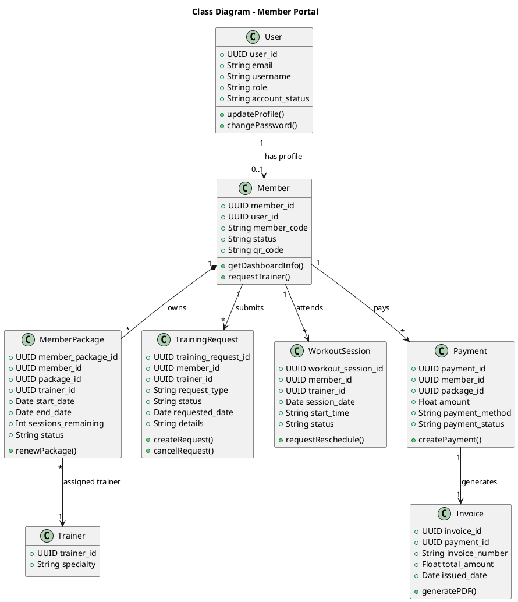
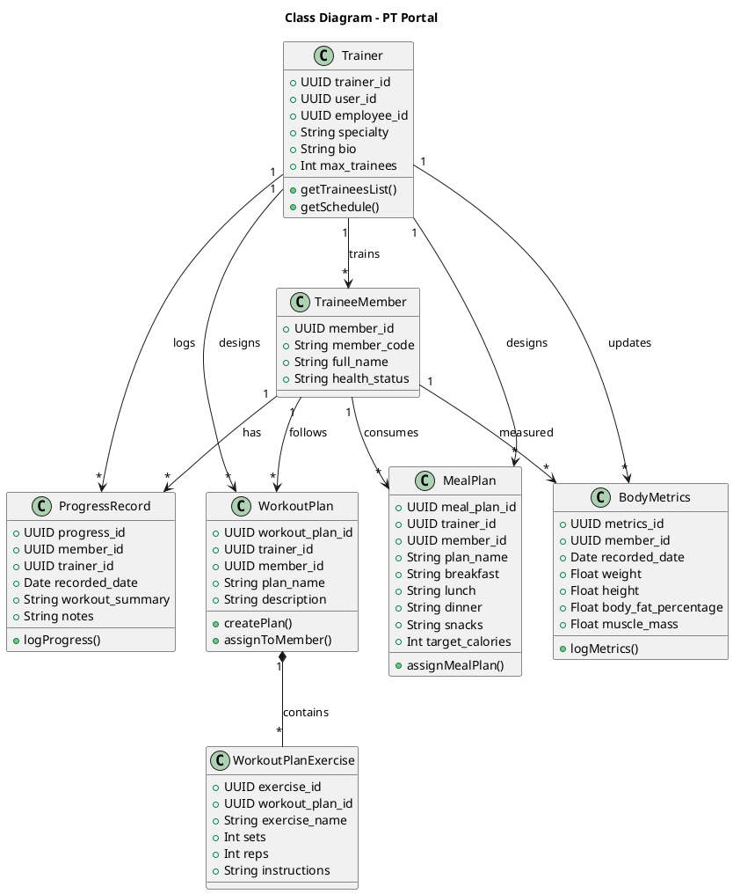
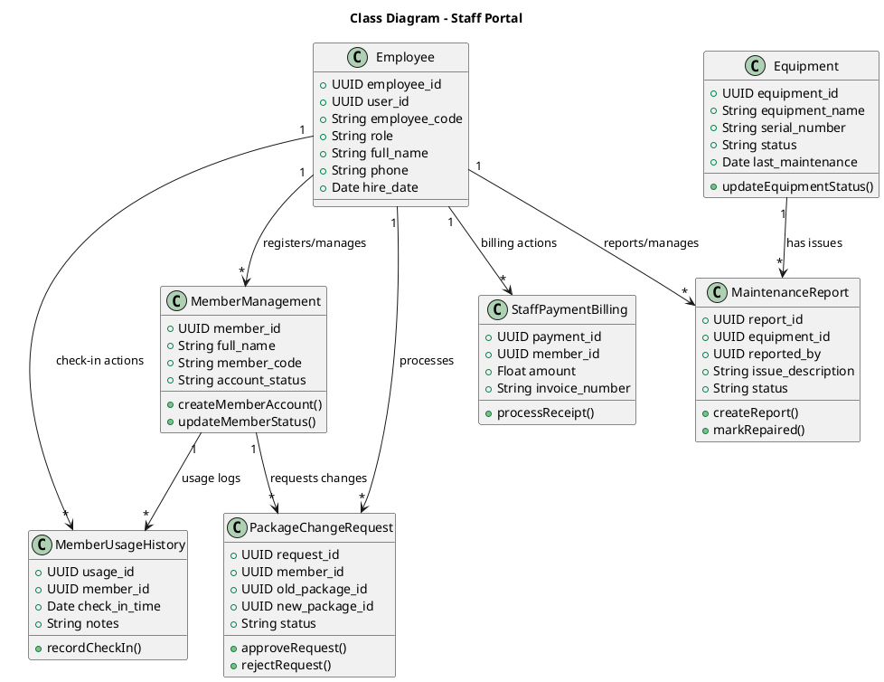
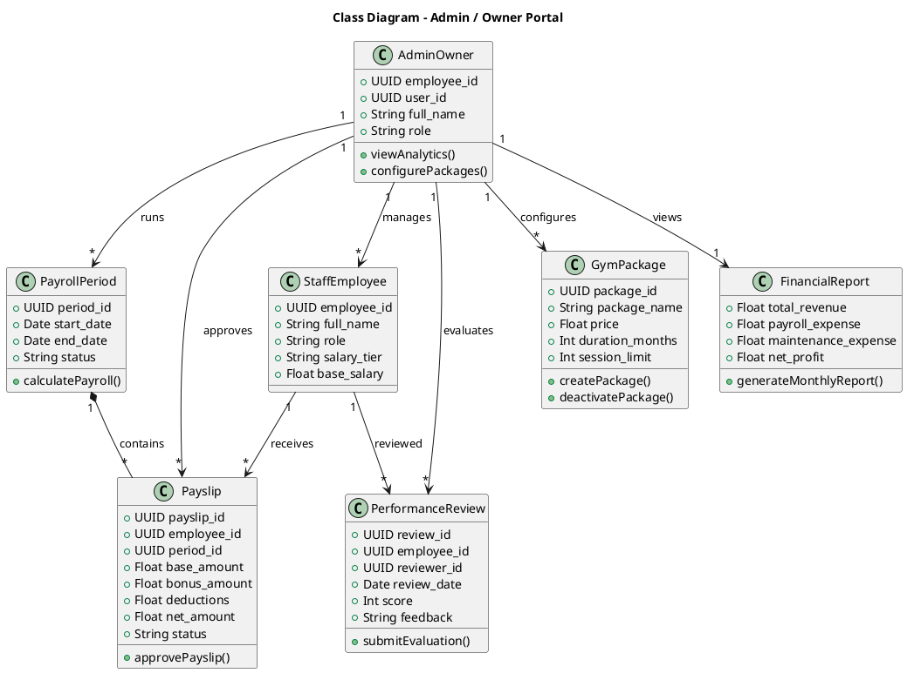

# 12 - Sơ đồ UML (Class Diagram & Sequence Diagram) - Định dạng PlantUML

Tài liệu này cung cấp mã nguồn UML dưới định dạng **PlantUML** (`@startuml ... @enduml`) cho cả **Class Diagram (Sơ đồ lớp)** và **Sequence Diagram (Sơ đồ tuần tự)** của **4 vai trò chính** trong hệ thống Gymster. Bạn có thể sao chép trực tiếp các đoạn mã này vào công cụ PlantUML để kết xuất sơ đồ mà không gặp lỗi cú pháp.

---

## I. VAI TRÒ HỘI VIÊN (MEMBER)

### 1. Class Diagram cho Hội viên (PlantUML)


### 2. Sequence Diagram cho Hội viên: Yêu cầu đổi lịch tập PT (PlantUML)
```plantuml
@startuml
title Sequence Diagram - Member Request Reschedule PT Session
autonumber

actor Member as "Member (Hội viên)"
participant UI as "Member Portal UI"
participant WS as "WorkoutSessionService"
participant TR as "TrainingRequestService"
database DB as "Supabase DB"
actor PT as "PT / Trainer"

Member -> UI : Click "Request Reschedule" on PT Session
activate UI
UI -> WS : checkSessionConflict(sessionId, newDate, newTime)
activate WS
WS -> DB : Query conflicting sessions for PT & Member
activate DB
DB --> WS : Return conflicts (if any)
deactivate DB

alt Conflict detected
    WS --> UI : Show error "Time slot not available"
    UI --> Member : Display conflict warning
else No conflict
    WS -> TR : createRescheduleRequest(sessionId, memberId, ptId, newDate, newTime)
    activate TR
    TR -> DB : Insert into training_requests (status = 'pending')
    activate DB
    DB --> TR : Return request details
    deactivate DB
    TR --> UI : Return success notification
    deactivate TR
    UI --> Member : Show "Request sent to PT"
    deactivate UI
    
    %% PT interaction
    PT -> DB : View pending training_requests
    activate DB
    PT -> DB : Approve request
    DB -> DB : Update workout_sessions (new datetime) & training_requests (status = 'approved')
    DB --> PT : Update successful
    deactivate DB
    
    note over Member, PT : System sends notification to Member
    Member -> UI : Refresh Schedule
    activate UI
    UI -> DB : Fetch updated workout_sessions
    activate DB
    DB --> UI : Return updated sessions
    deactivate DB
    UI --> Member : Show rescheduled session (Approved)
    deactivate UI
end
deactivate WS
@enduml
```

---

## II. VAI TRÒ HUẤN LUYỆN VIÊN (PT / TRAINER)

### 1. Class Diagram cho PT / Trainer (PlantUML)


### 2. Sequence Diagram cho PT: Nhập tiến độ học viên & Gán giáo án (PlantUML)
```plantuml
@startuml
title Sequence Diagram - PT Logs Progress & Assigns Workout Plan
autonumber

actor PT as "PT / Trainer"
participant UI as "PT Portal UI"
participant WP as "WorkoutPlanService"
participant PR as "ProgressService"
database DB as "Supabase DB"
actor Member as "Member (Hội viên)"

%% Log Progress and Metrics
PT -> UI : Select trainee and open "Progress & Metrics"
activate UI
UI -> DB : Fetch trainee current body metrics
activate DB
DB --> UI : Return metrics history
deactivate DB
PT -> UI : Input new Weight, Body Fat % and session notes
UI -> PR : saveTraineeProgress(memberId, trainerId, metricsData, notes)
activate PR
PR -> DB : Insert into body_metrics & progress_records
activate DB
DB --> PR : Return success
deactivate DB
PR --> UI : Show "Progress saved successfully"
deactivate PR
deactivate UI

%% Assign Workout Plan
PT -> UI : Click "Create Workout Plan"
activate UI
PT -> UI : Enter plan name & add exercises (sets, reps)
UI -> WP : createAndAssignPlan(planData, memberId)
activate WP
WP -> DB : Insert into workout_plans
activate DB
DB --> WP : Return plan_id
deactivate DB
WP -> DB : Bulk insert into workout_plan_exercises
activate DB
DB --> WP : Return success
deactivate DB
WP --> UI : Show "Workout plan assigned"
deactivate WP
deactivate UI

note over Member : Member receives in-app notification
Member -> DB : View My Workout Plan (Member Portal)
activate DB
DB --> Member : Render plan details & exercises
deactivate DB
@enduml
```

---

## III. VAI TRÒ NHÂN VIÊN LỄ TÂN (STAFF)

### 1. Class Diagram cho Nhân viên Lễ tân (PlantUML)


### 2. Sequence Diagram cho Staff: Điểm danh (Check-in) & Gia hạn gói (PlantUML)
```plantuml
@startuml
title Sequence Diagram - Staff Check-In & Package Renewal
autonumber

actor Staff as "Staff / Lễ tân"
participant UI as "Staff Portal UI"
participant CO as "CheckInService"
participant PK as "PackageService"
database DB as "Supabase DB"
actor Member as "Member (Hội viên)"

Member -> Staff : Present Member Code / QR Code
Staff -> UI : Enter Member Code / Scan QR Code
activate UI
UI -> CO : verifyMemberAndCheckIn(memberCode)
activate CO
CO -> DB : Query member status and active packages
activate DB
DB --> CO : Return membership details
deactivate DB

alt Membership Active & Sessions > 0
    CO -> DB : Insert into member_usage_history & decrement sessions
    activate DB
    DB --> CO : Return check-in success
    deactivate DB
    CO --> UI : Display Green Check-in Alert
    UI --> Staff : Access granted, show welcome info
else Membership Expired / Out of sessions
    CO --> UI : Display Red Alert (Expired / Out of sessions)
    deactivate CO
    UI --> Staff : Show "Renewal Required"
    deactivate UI
    
    %% Package Renewal Flow
    Staff -> Member : Inform about package expiration
    Member -> Staff : Request package renewal & pay at counter
    Staff -> UI : Select package and click "Renew Package"
    activate UI
    UI -> PK : renewMemberPackage(memberId, packageId, paymentMethod = 'Cash')
    activate PK
    PK -> DB : Insert into package_change_requests (status = 'approved')
    activate DB
    PK -> DB : Insert payment & invoice record
    PK -> DB : Insert / update member_packages (status = 'active')
    DB --> PK : Success response
    deactivate DB
    PK --> UI : Return billing receipt data
    deactivate PK
    UI -> Staff : Prompt to print receipt
    deactivate UI
    Staff -> Member : Give printed receipt & welcome to gym
end
@enduml
```

---

## IV. VAI TRÒ CHỦ PHÒNG TẬP (OWNER / ADMIN)

### 1. Class Diagram cho Chủ phòng tập (PlantUML)


### 2. Sequence Diagram cho Owner: Tính toán bảng lương & Đánh giá hiệu suất (PlantUML)
```plantuml
@startuml
title Sequence Diagram - Owner Evaluates Performance & Runs Payroll
autonumber

actor Owner as "Owner / Chủ phòng tập"
participant UI as "Owner Portal UI"
participant PR as "PayrollService"
participant EV as "PerformanceService"
database DB as "Supabase DB"
actor Staff as "Staff / PT"

%% Performance Evaluation
Owner -> UI : Go to "Performance Evaluation" page
activate UI
Owner -> UI : Select employee and enter score (1-5), comments
UI -> EV : submitPerformanceReview(employeeId, reviewerId, score, feedback)
activate EV
EV -> DB : Insert into performance_reviews
activate DB
DB --> EV : Success response
deactivate DB
EV --> UI : Show "Performance review saved"
deactivate EV
deactivate UI

%% Calculate & Approve Payroll
Owner -> UI : Go to "Payroll Management"
activate UI
Owner -> UI : Click "Calculate Payroll" for current period
UI -> PR : calculatePeriodPayroll(periodId)
activate PR
PR -> DB : Query employee ca trực & trainer sessions completed
activate DB
DB --> PR : Return session/shift logs
deactivate DB
PR -> PR : Calculate basic salary, session bonuses, review bonuses
PR -> DB : Insert payroll entries into payslips (status = 'draft')
activate DB
DB --> PR : Success response
deactivate DB
PR --> UI : Display draft payroll breakdown table
deactivate PR
deactivate UI

Owner -> UI : Click "Approve & Pay All"
activate UI
UI -> PR : approveAndDisbursePayroll(periodId)
activate PR
PR -> DB : Update payslips (status = 'paid') & create transactions
activate DB
DB --> PR : Success response
deactivate DB
PR --> UI : Show "Payroll approved. Payslips sent."
deactivate PR
deactivate UI

note over Staff : Employee receives payslip notification via email / in-app
@enduml
```
