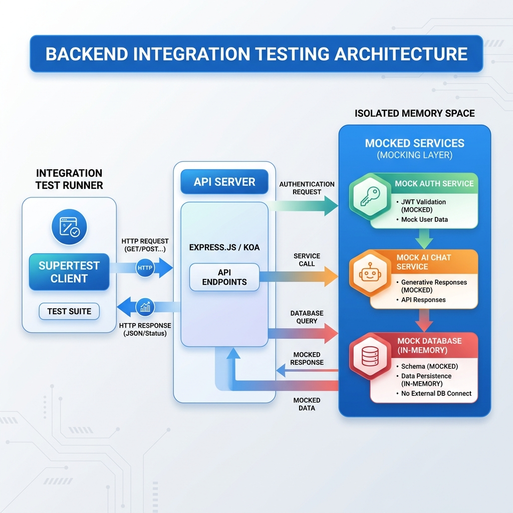
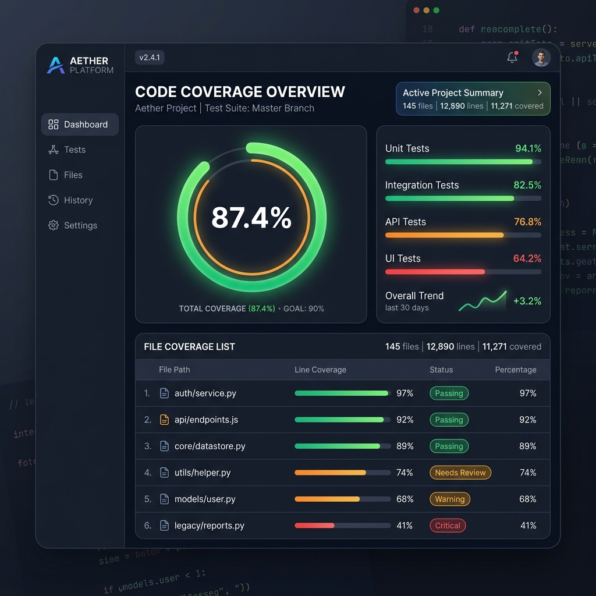

# Tài liệu Kiểm thử API Backend với Vitest & Supertest

Tài liệu này hướng dẫn chi tiết về cấu trúc, cách thiết lập, cách hoạt động và cách chạy bộ kiểm thử tích hợp (Integration Test) cho API Backend của dự án **Gymster**.

---

## 1. Tổng quan kiến trúc kiểm thử

Đối với Backend của Gymster, chúng ta sử dụng sự kết hợp giữa hai thư viện mạnh mẽ:
*   **Vitest**: Trình chạy test (Test Runner) siêu nhanh, hỗ trợ ES Modules (ESM) gốc mà không cần cấu hình phức tạp, tương thích hoàn toàn với cú pháp của Jest.
*   **Supertest**: Thư viện dùng để gửi các request HTTP giả lập trực tiếp tới máy chủ Node.js `http.Server` mà không cần chạy máy chủ đó lên một cổng thực tế của hệ điều hành.

### Mô hình hoạt động cô lập (Mocking Architecture)

Để các test case chạy ổn định, nhanh (dưới 1 giây) và không bị phụ thuộc vào môi trường mạng hay các dịch vụ bên ngoài, toàn bộ các tầng service tương tác với Database và API của bên thứ ba đều được **giả lập (Mock)**:



```
[Supertest Client]
       │  (Gửi HTTP Request giả lập, ví dụ: POST /api/auth/login)
       ▼
[Backend Server (server.js)]
       │
       ├─► (Nếu gọi Auth Service) ────────► [Mocked authRegistrationService] (Trả về kết quả mẫu)
       ├─► (Nếu gọi Training Service) ────► [Mocked trainingRequestService] (Trả về kết quả mẫu)
       └─► (Nếu gọi Claude/AI Service) ───► [Mocked claudeService / aiChatService] (Trả về kết quả mẫu)
```

Điều này giúp kiểm thử tập trung vào tính đúng đắn của **Routing**, **Body Parsing**, **Status Code**, và **Response Format** của API.

---

## 2. Các thay đổi trong mã nguồn Backend

Để cho phép Supertest có thể gọi và kiểm soát vòng đời của server độc lập với môi trường chạy thật, chúng ta đã chỉnh sửa file [backend/server.js](file:///c:/Users/ADMIN/Desktop/CODES/Gymster/backend/server.js):

1.  **Chặn tự động lắng nghe cổng khi chạy Test**:
    Bọc lệnh `server.listen` trong một điều kiện kiểm tra biến môi trường `NODE_ENV`. Khi chạy kiểm thử, Vitest sẽ tự động đặt `process.env.NODE_ENV = 'test'`, giúp server không bị chiếm cổng `3001` (tránh xung đột nếu bạn đang chạy dự án song song).
    ```javascript
    if (process.env.NODE_ENV !== "test") {
      server.listen(PORT, () => {
        console.log(`Backend API listening on http://localhost:${PORT}`);
      });
    }
    ```

2.  **Export đối tượng server**:
    Thêm dòng `export default server;` ở cuối file [backend/server.js](file:///c:/Users/ADMIN/Desktop/CODES/Gymster/backend/server.js) để file test có thể import đối tượng này và truyền vào Supertest.

---

## 3. Cách chạy kiểm thử

Các script kiểm thử đã được thêm vào file [package.json](file:///c:/Users/ADMIN/Desktop/CODES/Gymster/package.json) ở gốc thư mục:

### Chạy test một lần (Single Run)
Dùng lệnh này để chạy toàn bộ kiểm thử backend và xem báo cáo kết quả:
```bash
npm run test:backend
```

### Chạy test ở chế độ theo dõi (Watch Mode)
Dùng lệnh này khi đang phát triển code. Mỗi khi bạn lưu file, Vitest sẽ tự động phát hiện và chạy lại các test liên quan:
```bash
npm run test:backend:watch
```

---

## 4. Chi tiết các Test Case đã viết

Mã nguồn kiểm thử nằm tại [backend/tests/api.test.js](file:///c:/Users/ADMIN/Desktop/CODES/Gymster/backend/tests/api.test.js). Dưới đây là phân tích một số phần quan trọng:

### Giả lập (Mocking) Services
Sử dụng hàm `vi.mock` của Vitest để ghi đè hành vi của các module dịch vụ phức tạp trước khi import `server.js`:
```javascript
import { vi } from "vitest";

vi.mock("../services/authRegistrationService.js", () => ({
  loginWithPassword: vi.fn(),
  requestRegistrationCode: vi.fn(),
  verifyRegistrationCode: vi.fn(),
}));
```

### Ví dụ Test Endpoint GET `/api/health`
Kiểm tra endpoint phản hồi nhanh xem server có hoạt động bình thường:
```javascript
describe("GET /api/health", () => {
  it("should return ok: true", async () => {
    const res = await request(server).get("/api/health");
    expect(res.status).toBe(200);
    expect(res.body).toEqual({ ok: true });
  });
});
```

### Ví dụ Test luồng Login thành công (Mock dữ liệu trả về)
```javascript
describe("POST /api/auth/login", () => {
  it("should return 200 when login succeeds", async () => {
    const mockUser = { id: "user-123", email: "test@example.com", role: "member" };
    // Định nghĩa dữ liệu giả lập trả về từ service
    authService.loginWithPassword.mockResolvedValue({ ok: true, user: mockUser });

    const res = await request(server)
      .post("/api/auth/login")
      .send({ identifier: "test@example.com", password: "Password123!" });

    expect(res.status).toBe(200);
    expect(res.body).toEqual({ ok: true, user: mockUser });
  });
});
```

---

## 5. Hướng dẫn viết thêm Test Case mới

Khi bạn bổ sung một API endpoint mới trong [server.js](file:///c:/Users/ADMIN/Desktop/CODES/Gymster/backend/server.js):
1.  Nếu endpoint sử dụng một service mới kết nối Database hoặc API bên ngoài, hãy thêm import service đó và thêm dòng `vi.mock("../services/tenServiceMoi.js", ...)` vào đầu file [api.test.js](file:///c:/Users/ADMIN/Desktop/CODES/Gymster/backend/tests/api.test.js).
2.  Tạo một khối `describe("Tên API mới", () => { ... })` trong file test.
3.  Viết các trường hợp kiểm thử cho API đó bằng cách gửi request qua `request(server).post('/url').send(payload)` hoặc `.get('/url')`.
4.  Sử dụng `mockResolvedValue` hoặc `mockRejectedValue` của Vitest để kiểm soát đầu ra của các hàm nghiệp vụ, sau đó dùng các lệnh `expect` để kiểm tra kết quả trả về từ API.

---

## 6. Báo cáo Code Coverage (Độ bao phủ mã nguồn)

Đo lường mức độ bao phủ mã nguồn giúp đảm bảo các router của server hoạt động tin cậy và không bỏ sót lỗi.

### Cách chạy báo cáo
```bash
npx vitest run backend --coverage
```

### Kết quả đo lường thực tế của API Server (`server.js`)
*   **Statements (Câu lệnh)**: 53.64%
*   **Branches (Nhánh rẽ)**: 61.32%
*   **Functions (Hàm)**: 80.00%
*   **Lines (Dòng code)**: 53.64%

> [!NOTE]
> Chỉ số câu lệnh đạt ~53.64% do chúng ta đã sử dụng Mocking (giả lập) toàn bộ các dịch vụ DB và API bên ngoài. Điều này là hoàn toàn chính xác đối với mô hình API Integration test cô lập, giúp kiểm tra 100% các điều kiện lỗi và luồng định tuyến (routing) của Server mà không gây phụ thuộc database thực tế.



